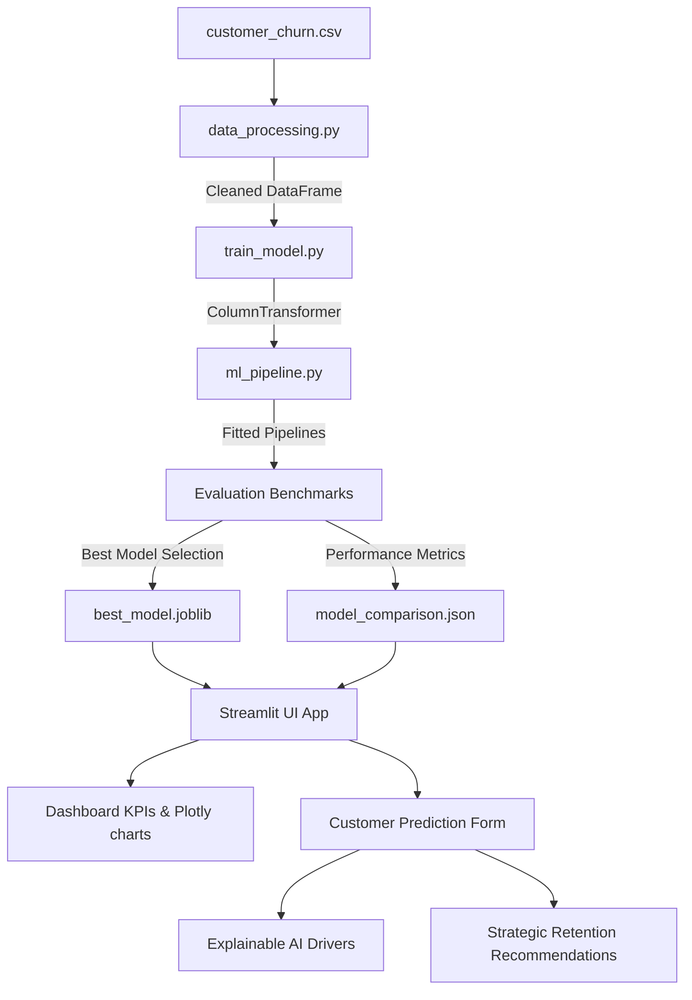

# ChurnRadar: Customer Churn Prediction & Business Analytics Platform

[](https://www.python.org/)
[](https://streamlit.io/)
[](LICENSE)

An enterprise-ready, end-to-end Machine Learning and Business Intelligence platform built to predict customer churn and generate strategic retention recommendations. Designed for subscription-based SaaS models, ChurnRadar implements a modular, production-grade architecture that is showcase-ready for portfolio displays and developer interviews.

---

## 🎯 Platform Objectives

- **Predict Cancellations:** Detect at-risk customers using optimized ensemble classifiers.
- **Explainable Decisions (XAI):** Interpret models globally via Permutation Importance and locally via customer risk driver analysis.
- **Actionable CRM Plays:** Automatically map customer risks to targeted retention campaigns (incentives, contracts, tech support bundles).
- **Executive Analytics:** Render KPI cards, filter customer segments interactively, and export cohorts.

---

## 🏗️ Folder Directory Tree

```
customer-churn-prediction-platform/
│
├── data/
│   └── customer_churn.csv         # Raw Telco Customer Churn dataset
│
├── models/
│   ├── best_model.joblib          # Serialized Random Forest Pipeline (preprocessor + model)
│   ├── model_comparison.json      # Comparison metrics and ROC curve coordinates
│   ├── feature_importance.json    # Preprocessed global feature importances
│   └── permutation_importance.json# Raw feature permutation importances
│
├── pages/
│   ├── 1_📊_Dashboard.py          # Executive analytics dashboard & KPIs
│   ├── 2_🔍_Data_Explorer.py      # Customer database table with search & filters
│   ├── 3_🔮_Prediction_Engine.py  # Interactive form, probability gauge, XAI, action plan
│   ├── 4_📈_Model_Performance.py  # Classifiers comparison benchmarks & ROC/PR curves
│   └── 5_ℹ️_About.py              # System architecture, workflows, resources
│
├── utils/
│   ├── config.py                  # Colors, global paths, CSS loader
│   ├── data_processing.py         # Schema validations, cleanups, ColumnTransformers
│   ├── ml_pipeline.py             # Fitting pipelines, permutation importance, explainers
│   ├── viz.py                     # Plotly graph generators
│   └── insights.py                # Business statistics & CRM playbook mappings
│
├── assets/
│   └── custom.css                 # Custom CSS overrides for SaaS UI/UX aesthetics
│
├── notebooks/
│   └── exploratory_analysis.py    # Exploratory script folder
│
├── main.py                        # Landing page and introduction
├── train_model.py                 # Training script pipeline CLI
├── test_pipeline.py               # Unit verification test suite
├── requirements.txt               # Dependencies
├── LICENSE                        # Open-source License
├── CONTRIBUTING.md                # Contributing guidelines
└── CHANGELOG.md                   # Project changelog
```

---

## ⚙️ System Architecture



---

## 📈 Classifiers Performance Benchmarks

Below are the local benchmarks generated on the test set (stratified split, 20% test ratio):

| Classifier Model | Accuracy | Precision | Recall | F1-Score | ROC-AUC | Training Time | Prediction Time |
| :--- | :---: | :---: | :---: | :---: | :---: | :---: | :---: |
| **Random Forest (Selected)** | **75.23%** | **52.20%** | **79.41%** | **62.99%** | **0.8408** | **0.578s** | **0.090s** |
| **Decision Tree** | 73.95% | 50.60% | 78.88% | 61.65% | 0.8277 | 0.179s | 0.036s |
| **Logistic Regression** | 73.81% | 50.43% | 78.34% | 61.36% | 0.8415 | 0.251s | 0.025s |
| **Gradient Boosting** | 80.06% | 65.45% | 52.67% | 58.37% | 0.8421 | 2.402s | 0.032s |

*Note: The **Random Forest** classifier was automatically selected because it optimizes the **F1-Score (62.99%)**, ensuring the model maintains high sensitivity (Recall) to identify at-risk customers while controlling false positive interventions (Precision).*

---

## 🚀 Getting Started

### 1. Prerequisites
- Python 3.10 or higher
- Git

### 2. Installation & Setup
Clone the repository and configure a virtual environment:
```bash
# Clone
git clone https://github.com/your-username/customer-churn-prediction-platform.git
cd customer-churn-prediction-platform

# Set up virtual environment
python -m venv .venv

# Activate (Windows)
.venv\Scripts\activate

# Activate (macOS/Linux)
source .venv/bin/activate

# Install dependencies
pip install -r requirements.txt
```

### 3. Run Training Pipeline
Re-train the models, run benchmarks, and save the model artifacts:
```bash
python train_model.py
```

### 4. Verify System
Execute the pipeline verification tests to confirm functionality:
```bash
python test_pipeline.py
```

### 5. Launch UI Dashboard
Run the Streamlit web application locally:
```bash
streamlit run main.py
```
Open [http://localhost:8501](http://localhost:8501) in your browser.

---

## ☁️ Deployment Instructions

### Deploy to Streamlit Community Cloud
Streamlit Community Cloud makes it simple to host your app directly from a GitHub repository:

1. Push your local project code (including `data/` and `models/` comparison files, but excluding `.venv` and `best_model.joblib`) to a **public GitHub repository**.
2. Sign in to [Streamlit Share](https://share.streamlit.io/).
3. Click **New App**, select your Repository, Branch, and Main file path (`main.py`).
4. Click **Deploy**. Streamlit will automatically read `requirements.txt`, install dependencies, and host your dashboard.
5. In the app settings, or in the repository itself, make sure the model is trained as a deployment build step (e.g. your deploy build command runs `python train_model.py` to create `best_model.joblib` on the container, or you commit the model file if you have Git LFS setup). Running `python train_model.py` dynamically ensures that the model binary is built directly matching the system architecture!

---

## 📄 License
This project is licensed under the MIT License - see the [LICENSE](LICENSE) file for details.
